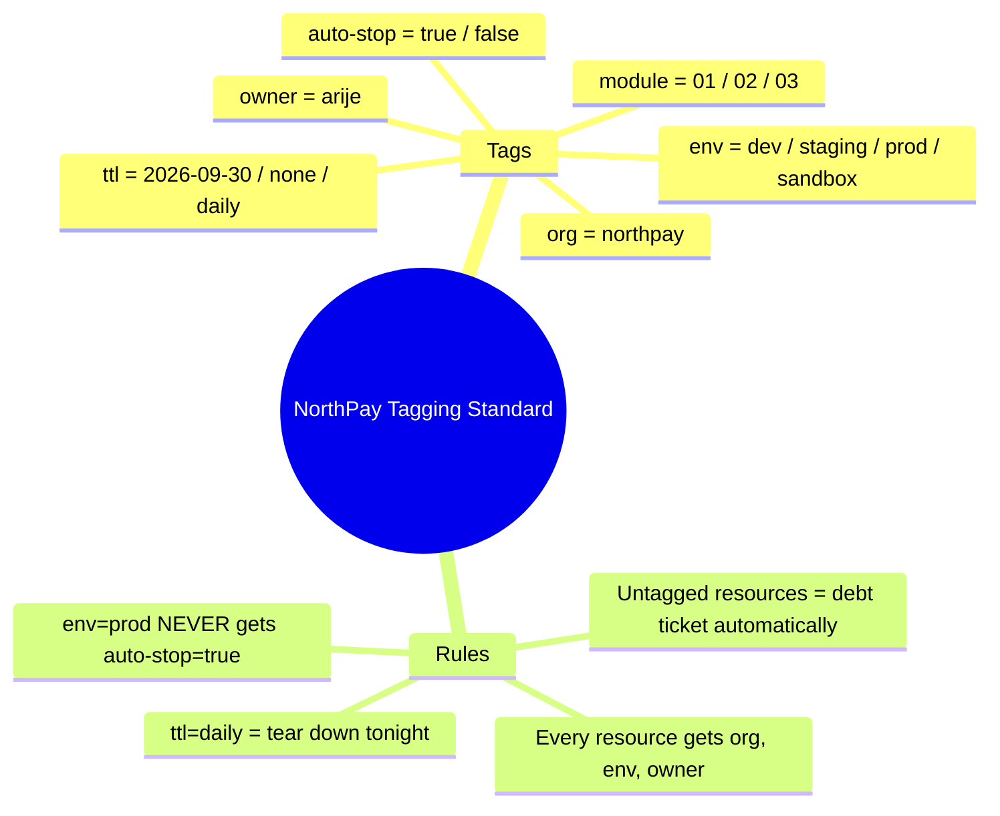

Here is **EXERCISE 0.1** reimagined as **six connected stories** from your first day at NorthPay. Each story has a *"2 AM incident version"* (why it matters), a *network-engineer analogy* (to anchor it to what you already know), and *exact micro-steps* you can execute right now.

---

# 🏦 Your First Day at NorthPay — The "Day Zero" Stories

> **Your situation:** You just joined NorthPay, a fintech startup processing payroll. The CEO says, *"You're our first SRE. Make sure we don't end up on the news."* The AWS account was created last week by a founder. It has no guardrails. This is your Day 1.

---

## Story 1 — MFA on Root: "The Master Key to the Building"

### The Scenario (Why This Is Story #1)

You walk in. The founder says, *"The root password is on a Post-it note in the kitchen."*

You freeze. The **root account** is the master key to the entire AWS organization. If someone gets that password, they can:
- Delete every database
- Remove every user
- Turn off logging
- Transfer the account to someone else
- And you would have **no audit trail of who did it**

In fintech, this is not just "bad practice." This is **an existential risk**.

### The Network Engineer Analogy

Think of the root account like the **physical master key to your data center** + **the ability to change the locks** + **the ability to delete the CCTV footage**. You don't carry that key in your pocket. You keep it in a safe. MFA is the safe.

### The Day-to-Day Job Reality

| Situation | Without MFA | With MFA |
|---|---|---|
| Founder forwards root password over Slack | Attacker logs in from Russia, deletes everything | Attacker needs the physical MFA code from your phone |
| Laptop with saved root password is stolen | Account is compromised in minutes | Useless without the MFA device |
| Employee leaves angry | They can't nuke the account from a coffee shop | They can't access root, period |
| Compliance auditor asks about root access | You have no answer | You show: "Root has MFA, never used, emergency only" |

### Your End Goal

You want to say in an interview: *"Root credentials are locked down with MFA, never used for daily operations, and access is reserved for account recovery only. All human access flows through Identity Center with short-lived credentials."*

### Concrete Micro-Steps

1. Sign in to AWS Console as root (email + password)
2. Top-right corner → Click your account name → **Security credentials**
3. Scroll to **Multi-factor authentication (MFA)** → **Assign MFA device**
4. Choose **Authenticator app** (Google Authenticator, Authy, or Bitwarden)
5. Scan QR code → Enter two consecutive codes → **Add MFA**
6. **Log out. Log back in.** Feel the friction. That's the point.

**Validation:**
```bash
# You can't easily validate MFA via CLI, but you can verify you have NO root access keys:
aws iam list-access-keys --user-name root
# Should fail (root is not an IAM user) or show nothing
```

---

## Story 2 — Identity Center (SSO): "The Badge System for the Cloud"

### The Scenario

You need to give yourself admin access. The junior way: create an IAM user named `arije`, generate an **access key ID + secret key**, and paste them into `~/.aws/credentials`.

**This is the old way. It's dangerous.**

Those keys are **long-lived**. If they leak (and they will — via Git, via screenshots, via malware), someone has permanent access to your account until you manually rotate them. In 2026, this is considered legacy.

The right way: **AWS IAM Identity Center** (formerly AWS SSO). Think of it like the badge system at a corporate office:
- You swipe your badge at the door → you get temporary access
- The access expires in a few hours
- If you lose your badge, you revoke it centrally
- You never have a "permanent key to the building"

### The Network Engineer Analogy

IAM Users with access keys = **giving every engineer the SNMP read-write community string** and hoping they don't leak it.

Identity Center = **TACACS+/RADIUS with 802.1X**: centralized, temporary, auditable, and you can see *who* accessed *what* from *where*.

### The Day-to-Day Job Reality

| Situation | IAM User with Keys | Identity Center SSO |
|---|---|---|
| Engineer joins the team | Create keys, email them (insecure) | Add to group, they sign in via portal |
| Engineer leaves | Did we delete their keys? Hope so. | Disable one account, all access dies |
| Keys found in GitHub | Panic rotation, audit every system | No keys in code — impossible to leak |
| Audit asks "who accessed prod last Tuesday?" | Good luck tracing keys | Full session logs with user identity |
| CLI access needed | Hardcode keys in `~/.aws/credentials` | `aws sso login` → temporary credentials auto-refreshed |

### Your End Goal

In an interview: *"We don't use long-lived IAM access keys for humans. Everyone authenticates through Identity Center, gets temporary credentials via SSO, and sessions expire automatically. This is our first line of defense against credential leakage."*

### Concrete Micro-Steps

1. In AWS Console → Search **IAM Identity Center** → Open it
2. Choose **Enable** (if not already enabled) → Choose **AWS Organizations** (even if org isn't set up yet, this is the right path)
3. Go to **Users** → **Add user**
   - Username: `arije` (or your name)
   - Email: your real email
   - First/Last name: fill in
4. Go to **Permission sets** → **Create permission set**
   - Type: **Predefined**
   - Policy: **AdministratorAccess** (we'll tighten this in Module 13 — for now, you need it to build)
   - Name: `Admin`
5. Go to **AWS accounts** → Select your account → **Assign users/groups** → Assign your user → Attach `Admin` permission set
6. Check your email → Accept the invitation → Set a password

**Validation (after Step 0.2 tool installation):**
```bash
aws configure sso
# SSO start URL: https://<your-org>.awsapps.com/start
# Region: ap-south-1
# Profile name: np-admin

aws sso login --profile np-admin
aws sts get-caller-identity --profile np-admin
# Should show your SSO user ARN, NOT root
```

---

## Story 3 — Billing Admins Group: "Finance Needs the Keys Too"

### The Scenario

It's month-end. Finance needs to download the invoice. They email you: *"Can you log in and get the PDF?"*

You are now the **bottleneck for every billing task**. Worse, if you give finance the root password to check bills, they can accidentally delete the account.

The fix: Create a **billing-admins** group with just enough access to see and manage billing — but **zero access to EC2, databases, or networks**.

### The Network Engineer Analogy

This is like giving the **accounting team read access to the network monitoring dashboard** but **not config access to the routers**. They can see the bill, but they can't break the network.

### The Day-to-Day Job Reality

| Situation | Without Billing Group | With Billing Group |
|---|---|---|
| Finance needs to see the monthly bill | You forward screenshots | They log in directly |
| CFO wants to set a budget alert | You act as a human proxy | They create it themselves |
| Tax team needs the invoice PDF | Slack message to you at 11 PM | Self-service download |
| Someone accidentally deletes a database | "I thought I was just looking at costs!" | Impossible — they don't have compute access |

### Your End Goal

*"Billing access is separated from operational access. Finance users have a dedicated permission set that only touches billing, invoices, and cost reports. They cannot see or modify production infrastructure."*

### Concrete Micro-Steps

1. AWS Console → **IAM** (not Identity Center for this one, or do it in Identity Center if preferred — we'll use IAM for simplicity)
2. **User groups** → **Create group**
   - Name: `billing-admins`
3. Attach policy: **Billing** (managed policy)
   - (Optional but good): Also attach `AWSBillingReadOnlyAccess` if you want read-only first
4. Add your SSO user to this group (or create a separate finance user later)

**Validation:**
```bash
# This is conceptual — billing is console-only mostly, but you can verify the policy exists:
aws iam list-attached-group-policies --group-name billing-admins --profile np-admin
```

---

## Story 4 — Account Alias: "The Professional Sign"

### The Scenario

The founder sends you the login URL: `https://123456789012.signin.aws.amazon.com/console`

You stare at 12 digits. Is this the prod account? The dev account? The sandbox? **You have no idea.**

Now imagine you have 5 accounts later (prod, dev, security, network, sandbox). Twelve-digit URLs are **unworkable**. An account alias turns it into:

`https://northpay-prod-lab.signin.aws.amazon.com/console`

Instantly recognizable. Professional. Harder to phish.

### The Network Engineer Analogy

This is like setting the **hostname and banner on a switch**. You *can* connect to `192.168.1.254`, but `CORE-SW-01.northpay.local` tells you what you're touching.

### The Day-to-Day Job Reality

| Situation | Without Alias | With Alias |
|---|---|---|
| Logging into the right account | Copy-paste account ID, hope it's right | Type `northpay-prod-lab`, confident |
| Bookmarking login pages | "aws-signin-1", "aws-signin-2" | `northpay-prod`, `northpay-dev` |
| Phishing resistance | Easy to fake a 12-digit number | Hard to fake your branded alias |
| Onboarding new engineers | "Which number is prod again?" | "Always bookmark the alias, never the number" |

### Your End Goal

*"We use human-readable account aliases for every AWS account. This reduces login errors, simplifies onboarding, and makes our sign-in URLs recognizable and brand-consistent."*

### Concrete Micro-Step

1. AWS Console → **IAM** → **Dashboard** (left sidebar)
2. Look for **Account alias** → **Create**
3. Enter: `northpay-prod-lab` (or your unique variation — must be globally unique)
4. Your new URL is: `https://northpay-prod-lab.signin.aws.amazon.com/console`

**Validation:**
```bash
aws iam list-account-aliases --profile np-admin
# Should return: northpay-prod-lab
```

---

## Story 5 — Budgets & Cost Anomaly Detection: "The Fire Alarm for Your Wallet"

### The Scenario (Week 2)

You're deep in Module 03, spinning up EC2 instances, NAT gateways, RDS databases. You forget one instance running over the weekend.

Monday morning: **AWS bill is $340 instead of $30.**

In a personal lab, that's annoying. In a company, that's **your first conversation with the CFO** — and not a good one. Worse, if someone compromises your account, they might spin up 100 crypto-mining instances. Without alarms, you find out **30 days later** when the invoice arrives.

### The Network Engineer Analogy

This is like **SNMP monitoring on your router interfaces** — but for dollars instead of bandwidth. You set thresholds. You get alerts *before* the link saturates. Budgets are your "utilization alerts" for money.

### The Day-to-Day Job Reality

| Situation | Without Budgets | With Budgets |
|---|---|---|
| Forgotten dev instance running for 2 weeks | $80 surprise | Alert at $8: "Shut this down" |
| Cryptominer compromise | $5,000 bill, found next month | Alert at $50: "Investigate NOW" |
| Finance asks "why did we spend 3× this month?" | You have no idea | You have an email from day 3 saying "we're at 80%" |
| End-of-month invoice shock | Stress, blame, budget cuts | Predictable, explainable, controlled |

### Your End Goal

*"Cost governance is Day-1 infrastructure. We have soft budgets for awareness, hard budgets for enforcement, and anomaly detection for unexpected spikes. In a fintech, uncontrolled cloud spend is as serious as an outage."*

### Concrete Micro-Steps

**Budget 1 — Soft Warning ($10):**
1. Console → **Billing and Cost Management** → **Budgets** → **Create budget**
2. Template: **Zero spend budget** (or custom)
3. Set amount: `$10`
4. Alert threshold: `80% of actual` → Email to you
5. Name: `np-soft-10usd`

**Budget 2 — Hard Stop ($30):**
1. Create another budget
2. Amount: `$30`
3. Alert at `100% actual` AND `90% forecasted` → Email to you
4. Name: `np-hard-30usd`

**Cost Anomaly Detection:**
1. Console → **Billing** → **Cost Anomaly Detection** → **Create monitor**
2. Monitor type: **AWS services**
3. Alert threshold: `$5` (or 10% of expected)
4. Email recipient: your email → **Confirm subscription** (check spam!)

**Validation:**
```bash
aws budgets describe-budgets --account-id $(aws sts get-caller-identity --query Account --output text --profile np-admin) --profile np-admin
# Should show both budgets
```

---

## Story 6 — CloudTrail: "The Security Camera" *(Recap from previous message)*

### The Scenario (Day 90 of your job)

It's 2 AM. Your phone rings. The payment gateway is down. The CTO is on the call asking: *"What changed?"*

You check CloudWatch — metrics look fine. You check the app logs — nothing unusual. But then you open **CloudTrail** and see:

```
14:03:22 — user ci-bot deleted the RDS security group rule
14:03:45 — 15 new connections failed
14:04:10 — payment API started returning 500s
```

**Boom.** In 30 seconds you know *who* did *what* and *when*. You revert the security group change. Incident resolved in 5 minutes instead of 2 hours.

### Without CloudTrail (The Horror Story)

Someone (maybe you, maybe a teammate, maybe a leaked credential) deletes a resource. AWS has **no built-in audit log** by default. You have:
- No idea *who* made the change
- No idea *from where* (IP address)
- No idea *what* the previous state was
- The compliance auditor asks for "who can access production data" — you have **zero evidence**

In a fintech (like NorthPay/slice/Deel), this is a **career-ending gap**. RBI/PCI auditors *will* ask for this.

### What CloudTrail Actually Is

Think of it like **syslog for your entire AWS account**, but better:
- Every API call is logged (who, what, when, from which IP)
- Multi-region = even if someone tries to hide activity in `us-east-1`, you still see it
- Log file validation = cryptographic proof the logs weren't tampered with (court-admissible)
- Stored in S3 = cheap, durable, queryable forever

### The Day-to-Day Job Reality

| Situation | How CloudTrail Saves You |
|---|---|
| "The production S3 bucket is now public!" | Search CloudTrail for `PutBucketAcl` → find the exact user and time |
| "Did we actually rotate those IAM keys?" | Search for `DeleteAccessKey` events |
| "Auditor wants proof of least-privilege" | Export 90 days of API calls showing only approved actions |
| "Someone launched a $500/day EC2 instance" | Find `RunInstances` event, trace to user/role |
| "Compliance needs evidence of encryption" | Prove `CreateBucket` had encryption enabled |

### Your End Goal for This Step

You want to be able to say in an interview: *"At NorthPay, every API call is captured in CloudTrail with log validation, stored in a dedicated S3 bucket with encryption, and retained for compliance. I can reconstruct any change in under 60 seconds."*

Instead of one vague task, do these **micro-steps**:

1. **Open AWS Console** → Search "CloudTrail" → Click "Create trail"
2. **Name it**: `northpay-org-trail` (not "management-events" — be descriptive)
3. **Check**: "Enable for all accounts in my organization" (even if you have 1 account now, this future-proofs it)
4. **Check**: "Create new S3 bucket" → Name: `northpay-cloudtrail-arije-2026` (use your name, make it globally unique)
5. **Check**: "Log file validation" → This proves logs weren't modified
6. **Check**: "Encrypt log files with SSE-KMS" → Use default AWS key for now
7. **Click Create** → Wait 5 minutes
8. **Validate**: Go to S3 → Your bucket → You should see a folder with a date → Inside, `.json.gz` files

**One-line validation command** (after your SSO login works in Step 2):
```bash
aws cloudtrail describe-trails --profile np-admin
# Should show your trail name and S3 bucket
```

You already have this one in detail above. Quick summary:

- **What:** Records every API call in AWS
- **Why:** When something breaks or someone does something bad, you can replay exactly what happened
- **Interview gold:** "I can reconstruct any infrastructure change in under 60 seconds"

**Quick micro-steps:**
1. Console → **CloudTrail** → **Create trail**
2. Name: `northpay-org-trail`
3. Storage location: Create new S3 bucket → `northpay-cloudtrail-arije-2026`
4. Enable **Log file validation**
5. Enable **Encryption**
6. Create → Wait 5 min → Check S3 bucket for `.json.gz` files

**Bottom line:** These aren't "setup chores." These are **the foundation of every SRE interview story** you'll tell. CloudTrail is your "detective tool." Tags are your "inventory system." Without them, you're flying blind. With them, you look like someone who has operated production systems before.


---

## Story 7 — Tag Strategy: "The Inventory System" *(Recap from previous message)*

### The Scenario (Month 3 of your job)

Finance emails you: *"Our AWS bill jumped from $800 to $4,200 this month. Find the leak."*

You open the Cost Explorer. Without tags, you see:

```
$2,100 — EC2
$1,500 — RDS
$600 — Data Transfer
```

**Useless.** You have 40 EC2 instances. Which team owns the expensive one? Is it production or someone's forgotten test lab?

Now imagine you had tags. You filter by `env=prod` and see production only costs $900. Then you filter `ttl=none` and find 3 instances tagged `env=dev` from 2 months ago still running — **the $3,300 leak**.

### Without Tags (The Money Fire)

- You can't allocate costs to teams
- You can't find who owns a resource
- You can't auto-shutdown dev/test resources at night
- You can't enforce "no production changes without approval"
- During an incident, you stare at `i-0a1b2c3d` and have **no idea** if it's the payment API or the internal wiki

### What Tags Actually Are

Think of AWS tags like **VLAN tags or interface descriptions** in your network world:
- `org=northpay` → "This belongs to our company" (prevents confusion in multi-org setups)
- `env=prod` → "Touching this causes a customer-facing outage"
- `owner=arije` → "Call this person at 2 AM"
- `ttl=2026-09-30` → "Delete this automatically after the project ends"
- `module=03` → "Created during AWS Foundations module; safe to tear down later"

### The Day-to-Day Job Reality

| Situation | How Tags Save You |
|---|---|
| "Is this RDS instance safe to delete?" | Check `env` tag — if `prod`, NO. If `dev` and `ttl` expired, yes. |
| "Who pays for this EKS cluster?" | Filter Cost Explorer by `team=platform` |
| "Nightly cost script" | Auto-stop anything with `env=dev` and `auto-stop=true` |
| "Compliance audit" | Prove all `env=prod` resources have encryption tags |
| "Finding the blast radius" | "Show me everything `owner=arije` touched this week" |

### Your End Goal for This Step

You want a **tagging standard so strict** that:
1. You can type one command and see every resource you own
2. Finance gets automatic cost reports by team/environment
3. A script can clean up your lab every night without touching production
4. In an interview, you say: *"I treat tags as critical metadata. At NorthPay, untagged resources are automatically flagged and flagged for deletion. Our cost attribution is 100% automated."*

Instead of "write a strategy," do this:

1. **Open** `~/northpay/daily-log.md`
2. **Paste this** (this IS your standard — commit it):

## NorthPay Tagging Standard (enforced from Day 1)



| Tag | Values | Why |
|-----|--------|-----|
| org | northpay | Company identifier |
| env | dev / staging / prod / sandbox | Environment isolation |
| owner | arije | Who to contact |
| ttl | 2026-09-30 / none / daily | When can this be deleted? |
| module | 01 / 02 / 03 ... | Which training module created this |
| auto-stop | true / false | Can we shut this down at night? |

### Rules

- EVERY resource gets at least `org`, `env`, `owner`
- `env=prod` NEVER gets `auto-stop=true`
- `ttl=daily` = tear down tonight
- Untagged resources = debt ticket automatically

3. **Apply it right now**: Go to your S3 bucket from Step 7 → Tags → Add:
   - `org=northpay`
   - `env=dev`
   - `owner=arije`
   - `module=01`
   - `ttl=2026-12-31`

---

## The Bigger Picture (Why These Come First)

| Task | Interview Question It Answers |
|------|------------------------------|
| CloudTrail | "How do you audit changes in AWS?" |
| CloudTrail | "Tell me about a time you investigated an incident." |
| Tags | "How do you manage cloud costs at scale?" |
| Tags | "How do you prevent dev resources from bleeding money?" |
| Both together | "How do you run a compliant, cost-controlled multi-account environment?" |


You already have this one in detail above. Quick summary:

- **What:** Labels on every resource
- **Why:** Know what something is, who owns it, when to delete it, and how much it costs
- **Interview gold:** "I treat untagged resources as technical debt and automate their cleanup"

**Your standard to paste into `daily-log.md`:**

## NorthPay Tagging Standard

| Tag | Values | Purpose |
|-----|--------|---------|
| org | northpay | Company identifier |
| env | dev / staging / prod / sandbox | Environment isolation |
| owner | arije | Human responsible |
| ttl | YYYY-MM-DD / none / daily | Deletion schedule |
| module | 01 / 02 / 03 ... | Training module origin |
| auto-stop | true / false | Nightly shutdown eligible? |

Rules:
- env=prod NEVER gets auto-stop=true
- ttl=daily = destroy tonight
- Untagged resources = automatic debt ticket


---

## 📋 The Complete Validation Checklist for EXERCISE 0.1

Before you move to EXERCISE 0.2, verify each story is real:

| Story | Validation Command / Check |
|-------|---------------------------|
| 1. MFA on root | Log out of root. Log back in. You needed your phone. |
| 2. Identity Center | `aws sts get-caller-identity --profile np-admin` shows SSO user |
| 3. Billing group | `aws iam list-attached-group-policies --group-name billing-admins` |
| 4. Account alias | `aws iam list-account-aliases` returns your alias |
| 5. Budgets | `aws budgets describe-budgets` shows 2 budgets |
| 5. Anomaly detection | Check email for AWS subscription confirmation |
| 6. CloudTrail | S3 bucket has `.json.gz` files in a date folder |
| 7. Tags | Your S3 bucket has tags: `org`, `env`, `owner`, `module`, `ttl` |

---

## 🎯 The "Day Zero" Interview Narrative

Once this exercise is done, you own this story:

> *"On Day 1 at NorthPay, I inherited a raw AWS account with no guardrails. Before spinning up a single server, I established the security baseline: root MFA, Identity Center SSO for all human access, separated billing permissions, CloudTrail for audit coverage, budget alarms at $10 and $30, and a strict tagging standard. This isn't overhead — it's the foundation that lets me sleep at night and answer auditor questions in 30 seconds."*

---
